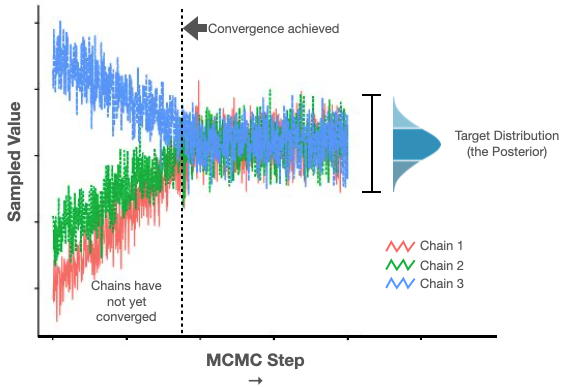
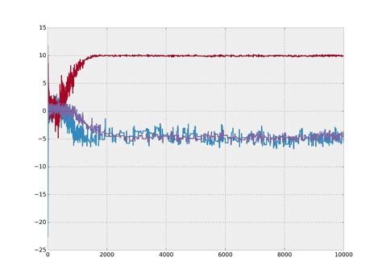
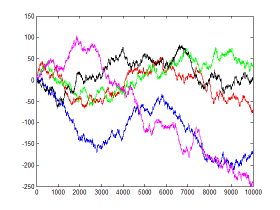

```{r, message=FALSE, warning=FALSE}
library(gridExtra)
library(rstan)
library(tidyverse)
library(tidybayes)
```

Let's review the model-building process in Stan.

First we write the program code.

```{r}
stan_program_code <- '
data {
  int<lower=1> n;
  vector[n] height;
  vector[n] weight;
}
parameters {
  real<lower=0,upper=50> sigma;
  real<lower=0> b;
  real a;
}
transformed parameters {
  vector[n] mu;
  mu = a + b * weight;
}
model {
  a ~ normal(178, 20);
  b ~ lognormal(0, 1);
  sigma ~ uniform(0, 50);
  weight ~ normal(100, 10);
  height ~ normal(mu, sigma);
}
'
```

We then compile the code.  This creates an object in the high-level program environment that points to an executable.

```{r, echo=FALSE}
compiled_program <- stan_model(model_code = stan_program_code)
```

```
compiled_program <- stan_model(model_code = stan_program_code)
```

Next, we make sure we can estimate point values of the parameters using ordinary gradient-based optimization.

```{r}
model_data <- read_delim("https://raw.githubusercontent.com/altdeep/probmodeler/main/tutorials/data/height_weight_age_male.csv", delim = ";") %>%
  filter(age >= 18)

stan_data <- model_data %>%
  select(height, weight) %>%
  compose_data

optim_result <- optimizing(compiled_program, data=stan_data)
message("sigma: ", round(optim_result$par["sigma"], 3))
message("a: ", round(optim_result$par["a"], 3))
message("b: ", round(optim_result$par["b"], 3))
message("mu[1]: ", round(optim_result$par["mu[1]"], 3))
```

The next step during the model building phase would be to use variational inference.  Variational inference is faster, and we can use the samples from variational inference as inputs to the downstream workflow.

For now we are going to assume model-building is complete and we are going to jump straight to sampling with HMC.

```{r, message=FALSE, results='hide'}
# Generate samples from the model.
# Just using one chain and 1000 samples to keep things light.
posterior <- sampling(
  compiled_program,
  stan_data,
  chains = 2,
  iter = 1000,
  warmup = 500
)
```

Now comes the step of visualizing model diagnostics.  The Stan interfaces come with their own plotting functions.  There are also several companion libraries for plotting.  Below, I show examples using the R package [bayesplot](https://mc-stan.org/bayesplot/), which is sits on top of [ggplot2](https://ggplot2.tidyverse.org/). In Python, [arviz](https://github.com/arviz-devs/arviz) is a popular choice.

```{r, message=FALSE}
library(bayesplot)
```

### Examining the trace

Markov chain Monte Carlo sampling techniques vary in implementation bout rely on one core idea.  The idea is that we can sample from a distribution we care about by constructing a special kind of random sampling process that will converge to that target distribution after we let it run for awhile.


So typically the first things we visually inspect during this diagnosis is our chains. 

```{r}
mcmc_trace(
    posterior,
    pars = c("sigma", "a", "b"),
    n_warmup = 500,
    facet_args = list(nrow = 2, labeller = label_parsed)) +
    facet_text(size = 15)
```

We inspect this by looking at each parameter and seeing that our chains *mixed* well.  In the above, the light blue and the dark blue chains are well-mixed.

The following image is an example of poor mixing. There are three chains indicated in red, purple and blue.  The red chain seems to have converged to a different distribution than the purple and blue.



Even if this were a two-mode distribution, we would expect the sampler to be sampling from near both modes.

Secondly, we look to see that the chains converged.  Above, we see that the samples are stable; we see a constant range on the Y axis (sampled values) as we move along the X axis (steps).

In the following example, we see five chains that failed to converge.  They rather follow what looks to be a random walk.



### Histogram/density plots of marginal posteriors

View marginal posteriors to access whether they make sense to you.  Does it look like it has changed relative to the prior?  Does the range of the sampled values make sense to you?  Is the marginal distribution unimodal or multimodal?  If it is multimodal, does it make sense to have more than one mode?

```{r, message=FALSE}

p1 <- mcmc_areas(posterior,
           pars = c("sigma"),
           prob = 0.8) +
    ggtitle("Posterior of `sigma`",
            "with 80% interval")
p2 <- mcmc_areas(posterior,
           pars = c("a"),
           prob = 0.8) +
    ggtitle("Posterior of `a`",
            "with 80% interval")
do.call("grid.arrange", c(list(p1, p2), ncol = 2))

p3 <- mcmc_areas(posterior,
           pars = c("b"),
           prob = 0.8) +
    ggtitle("Posterior of `b`",
            "with 80% interval")
p4 <- mcmc_areas(posterior,
           pars = c("mu[28]"),
           prob = 0.8) +
    ggtitle("Posterior of `mu[28]`",
            "with 80% interval")
do.call("grid.arrange", c(list(p3, p4), ncol = 2))      
```

